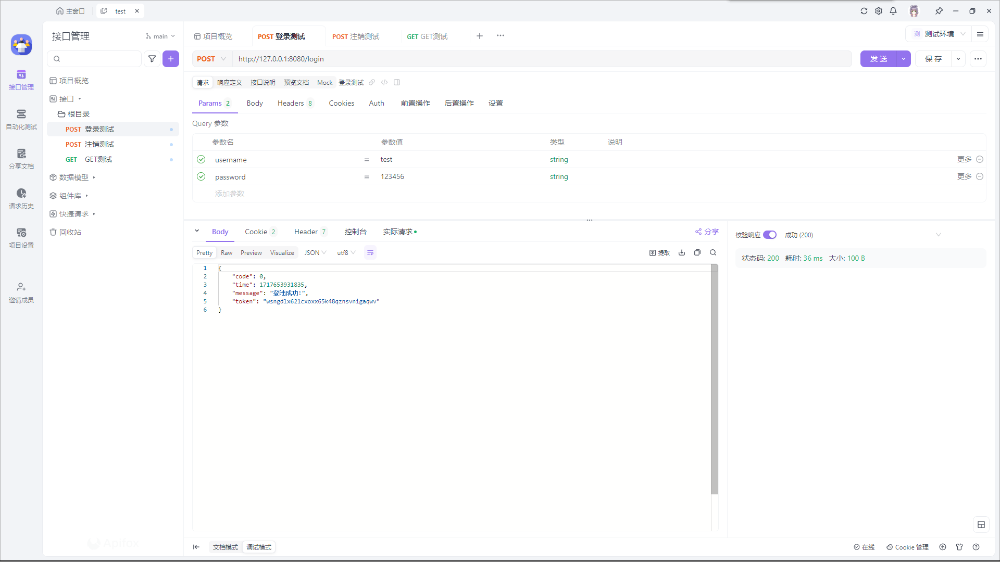
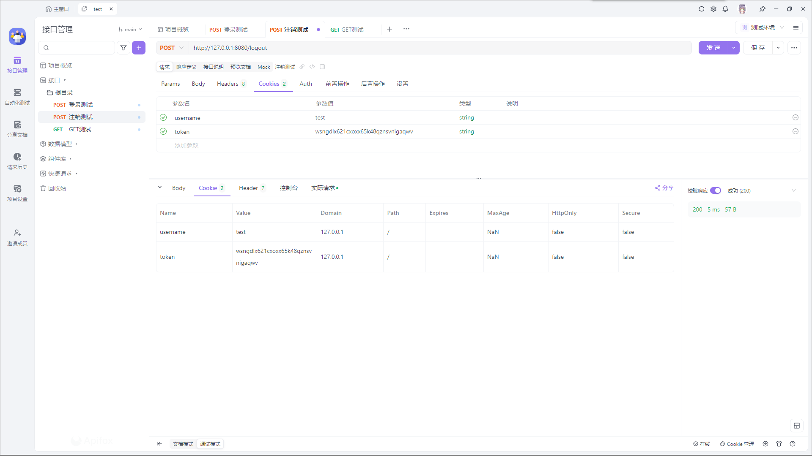
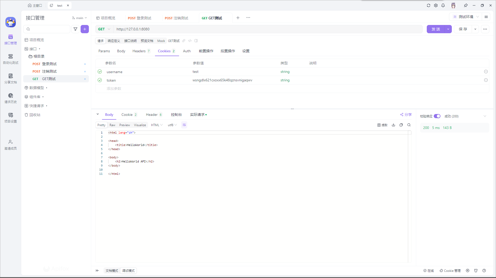

# 笔试题-后端
Implement a project using SpringBoot 3.2.0, with a GET method HelloWorld API that requires authentication, with username and password login API (could use username test and password 123456). Submit a GitHub link.

Spring Initializer已不再提供SpringBoot 3.2.0，故本项目采用SpringBoot 3.3.0

## 登录测试

## 注销测试

## GET测试
